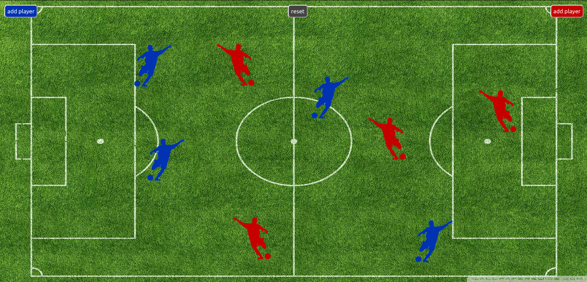

## Simplest socker team organaizer with laravel-websockets

This is a very simple project for implementation laravel-websockets.
I use the folowing libraries and frameworks on this repo:
- [Laravel](https://laravel.com)
- [Laravel-websockets](https://github.com/beyondcode/laravel-websockets)
- [Jquery](https://jquery.com)
- [Jquery-ui](https://jquery.com/jquery-ui)

## Screenshot


## Install and run

- ```composer install```
- ```php artisan migrate```
- ```php artisan serve```
- ```php artisan websockets:serve```